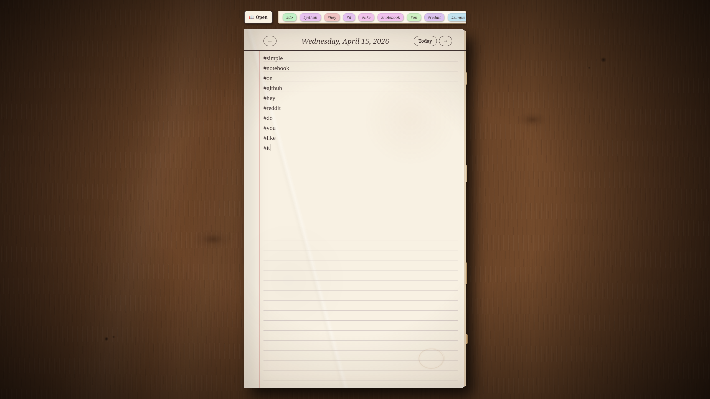
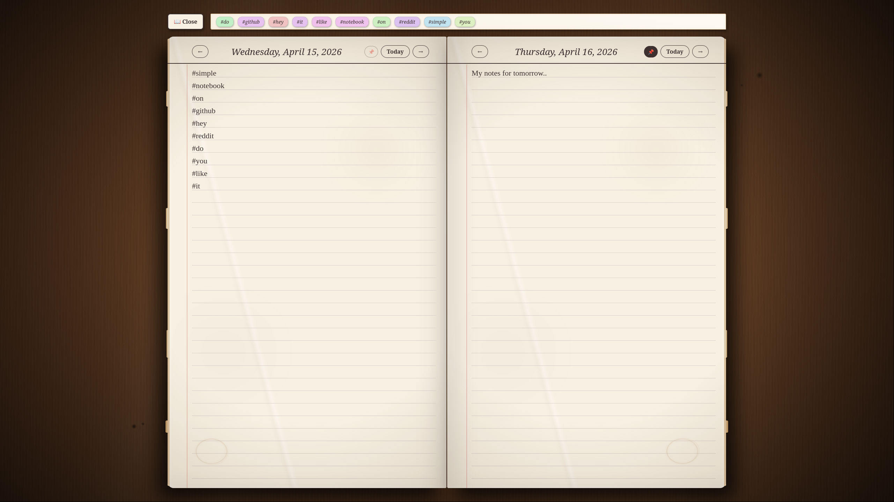
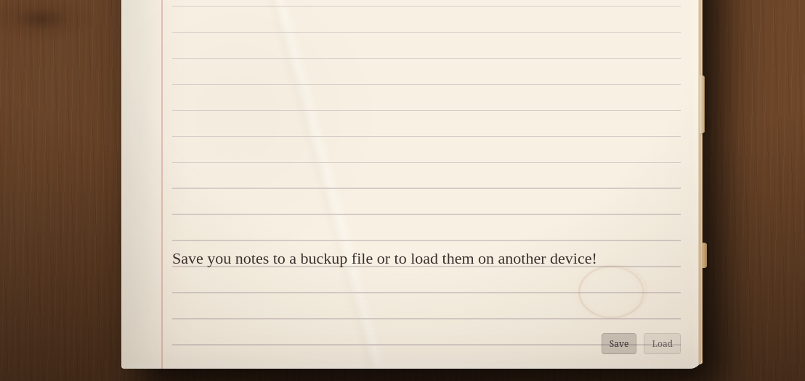

# Local Notebook

A simple, elegant, and completely local digital notebook designed for daily notes and quickly capturing thoughts. All your entries are stored directly in your browser's Local Storage, ensuring data privacy and offline access.

## Features

This notebook offers a range of features that enable a pleasant and efficient writing experience:

*   **Classic Notebook Aesthetic:** An appealing, skeuomorphic design with paper textures, lined pages, and subtle details for an authentic notebook feel.
*   **Local Storage:** All your notes are automatically and exclusively saved in your browser. No server, no cloud – your data remains private and is always available offline.
*   **Date-Based Navigation:** Effortlessly navigate through the days with "Previous," "Next," and "Today" buttons.
*   **Two-Page View:** Switch between a single page and a double-page spread for a more immersive writing experience.
*   **Rich Text Formatting:** Mark text as **bold**, *italic*, <u>underlined</u>, or <s>strikethrough</s> with a context-sensitive menu that appears upon text selection.
*   **Smart Formatting:** After a formatted word and a space, the formatting is automatically ended, allowing you to seamlessly continue writing with unformatted text.
*   **Hashtag Organization:** Hashtags are automatically extracted from your notes and displayed in a clickable bar to quickly jump to relevant dates.
*   **Import/Export Functionality:** Back up and restore all your notebook data as a JSON file.
*   **Responsive Design:** Adapts to different screen sizes, providing a comfortable writing experience on various devices.

## Installation

This notebook is a single HTML file, which makes installation incredibly simple!

1.  **Download the file:**
    *   Download the `localnotebook.html` file from this repository.
2.  **Open in browser:**
    *   Simply open the `localnotebook.html` file with your favorite web browser (e.g., Chrome, Firefox, Edge).

That's it! Your notebook will load, and all your data will be saved locally in your browser.

## Usage

*   **Getting Started:** Simply start typing in the note areas.
*   **Changing the Date:** Use the navigation buttons to change the date.
*   **Formatting Text:** Select text to display the formatting menu.
*   **Hashtags:** Click on hashtags in the bar to jump to the date they were first mentioned.
*   **Backup/Restore:** Use the "Save" (Export) and "Load" (Import) buttons (visible when hovering over the bottom of the page) for data backup and recovery.

## Screenshots

Here are some screenshots to give you an impression of the notebook's look and functionality:

    
    
    

## Contributing

Feel free to fork this repository, suggest improvements, or report issues!

## License

This project is open-source and available under the MIT License.
